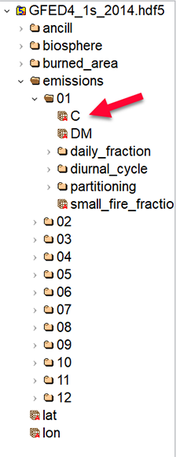
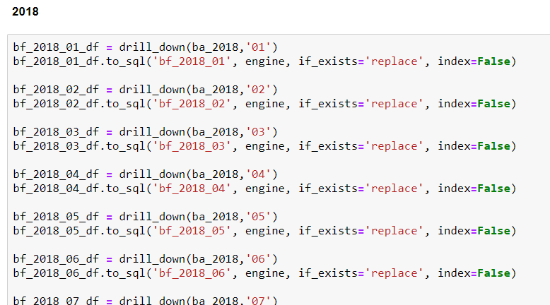
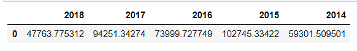

# Brazilian Amazon Rain Forest Fires and Economy correlation (Brazil_ETL)

During the summer of 2019 several fires were reported in the Amazon, as reported by BBC news in the link below:

https://www.bbc.com/news/world-latin-america-49433767

International governments considered this series of fires catastrophic (see reference here: https://www.bbc.com/news/world-latin-america-49443389), some countries offered help to Brazil, where most of the Amazon rain forest resides, to prevent more damages to what is considered the "lungs of the world"

We will attempt to find a correlation between:
 - Forest fires in Amazon
 - Brazilian government expenditures
 - Soy bean and corn production, demand and global prices

Here we are extracting monthly emissions data for the area of the Amazon Rainforest.

We will be looking at a five year span from 2014 to 2018. The goal is to try and see
if there is an increase in the amount of forest fires in the region and if the demand
for soybean and corn is directly linked to it.

### Data files
We will be using soybean and corn data gathered from Kaggle.com and carbon emissions data gathered from
the Global Fire Emissions Database (GFED). Data from GFED are all stored in HDF5 files and
requires some drilling down to get to the tables we need -- the monthly carbon emissions table.

### HDF5 files

HDF is completely portable file format with no limit on the number or size of data objects in the collection.  In this case, we are dealing with datasets that are 720 rows x 1440 columns for each month of the year and for each section of the GFED.

Each cell on the table corresponds to the latitude and longitude coordinates.  Each cell data contains a measurement for that coordinate on the map.  i.e. a percentage of how much area burned for that particular coordinate.  

### H5PY Library

We imported the H5PY library which allowed us to use python to parse through the database.  

To parse through it, it's as simple as the following command each layer. You will need to copy it to a variable and use .File() to keep going into the database. 

### Kaggle CSV files
Brazilian government expenses, including all the ones related to agriculture or land were obtained from https://www.kaggle.com/vicentegsantos/brazil-gov-expenses
the original file (Brazil_Gov_Exp_All - Formated.csv) was not in CSV format

so it was converted to Brazil.csv in Excel
 brazil_gov_format_csvOK

Corn and Soy bean production/consupmtion totals per year, including global and brazilian numbers obtained from https://www.kaggle.com/ainslie/usda-wasde-monthly-corn-soybean-projections
Saved all the soy files to "soy" subfolder, and all the corn files to "corn" subfolder

With the python glob library, we used the script shown below to combine all the files (per year) into a single for all the years

### Dataset 
The table we need resides in C under each month of the year.
We will extract this data and put it to a dataframe.
We then filter the data frame from column 444 to 519 and from row 352 to 399.
The table corresponds to the lat, long coordinates for the rectangular area that
is roughly the area of the Amazon Rainforest.

Coordinates
NW: 1.819447, -68.950113
NE: 1.819447, -50.397135
SE: -9.666005, -50.397135
SW: -9.666005, -68.950113

### HDF to PostGres SQL database

After finding and extracting the data, we copied each table to a Pandas dataframe and sent them to PostGres. 

We did this for every month for every year.  

### Pandas'CSV files to PostGres SQL database

All the Pandas CSV files were uploaded in the Postgress database as shown below:

### PostGres SQL database
Each team member connected to the GitHub project and PostGres database. Our database with all the tables, HDF5 and CSV, is shown on the pictures below:

### Appendix

Some additional data sources were also explored and added in the Jupyter notebook, that will help the analysis of the Amazon fires in future work, including:

- Corn price totals per month obtained, from https://www.kaggle.com/ainslie/usda-wasde-monthly-corn-soybean-projections. The original file was not in CSV format, so it was converted to csv in Excel
- Soy bean price totals per monthobtained, from https://www.kaggle.com/ainslie/usda-wasde-monthly-corn-soybean-projections. The original file was not in CSV format, so it was converted to csv in Excel
- Forest Fire Count per State in Brazil, obtained from https://www.kaggle.com/gustavomodelli/forest-fires-in-brazil

#### Emission Totals
An emission yearly total was also created for easier analysis.  These totals are grams of carbon per square meter (g C /m-2).

